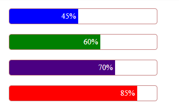

# ProgressBar with Percent Application

<p>
Supplies a modified GUIslice XProgress extended control that will display
the percent completed inside the progress bar.
</p>



<p>
This was originally a simple demonstration of how to use TFT_eSPI's sprite
animation with GUIslice. It now also supports Adafruit_GFX using canvas object for sprites.
It's a drop in replacement for the existing XProgress.<c,h> object. 
</p>

It adds one new API call to set the font:

```
///
/// Add a Font to Gauge element so it can display percent completed or remaining
///
/// \param[in]  pGui:        Pointer to GUI
/// \param[in]  pElemRef:    Pointer to Element reference
/// \param[in]  nFontId:     Font ID to use for drawing text
///
/// \return none
///
void gslc_ElemXProgressSetFont(gslc_tsGui* pGui,gslc_tsElemRef* pElemRef,int8_t nFontId);
```

<p>
The color of the text will default to white but you can optionally set the color 
of text using GUIslice's gslc_ElemSetTxtCol() call:
</p>

```
///
/// Update the text string color associated with an Element ID
///
/// \param[in]  pGui:        Pointer to GUI
/// \param[in]  pElemRef:    Pointer to Element reference
/// \param[in]  colVal:      RGB color to change to
///
/// \return none
///
void gslc_ElemSetTxtCol(gslc_tsGui* pGui,gslc_tsElemRef* pElemRef,gslc_tsColor colVal);
```

<p>
This new version will ignore the min and max parameters when you supply a Font to
the XProgress control. In this case only the values 0 to 100 will be recognized. 
While if you do not supply a font the XProgess control will revert to its old 
implementation. 
</p>

<p>
To install this version simply delete GUIslice/src/elem/XProgress.h and XProgress.c
and copy XProgress.cpp and XProgress.h inside the subfolder "elem" to your GUIslice/src/elem folder. 
</p>

<p>
The sample is set for Arduino using Adafruit_GFX library and a standard
320x240 pixel display but you can use the GUIsliceBuilder to set the
your display to another size or to use the TFT_eSPI library. 
Simply open the use the progress-percent.prj file within the GUIsliceBuilder, select the 
PROJECT_OPTIONS tab and make your changes before doing a new code generation.
</p> 
