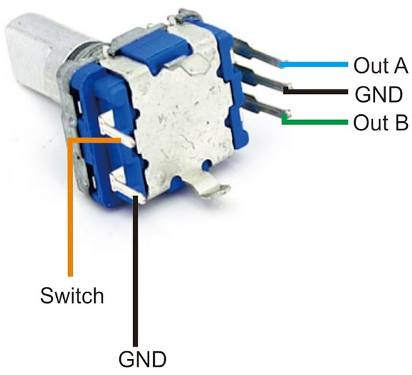

# Cycling Through Buttons Using Rotary Encoder

<p>
This is an example of using a Rotary Encoder in place of touch.
The sample demonstrates using Text Buttons, Checkboxes, radio buttons, jumping to new pages
and using popups.
</p>

<p>
This sample uses an inexpensive Rotary Encoder. Typically 20 to 24 detents.
</p>



<p>
The basic theory of using a Rotary Encoder with GUIslice is simular to the
GUIslice example arduino/ex04_ard_ctrls_pin/ex04_ard_ctrls_pin.ino.
The main difference is that you must first supply a routine to 
read the encoders A and B pins. 
</p>

<p>
In my sample its called read_rotary()
and it returns 1 for moving in a clockwise direction, -1 for Counter Clockwise,
and 0 for false input. 
</p>

<p>
Next you provide a callback function bool CbPinPoll() for the API to poll your rotary encoder:
</p>

```
  // Set the pin poll callback function
  gslc_SetPinPollFunc(pGui, CbPinPoll);
```

<p>
Folowup by creating a gslc_InitInputMap() and provide a set of integers to indicate
when to move NEXT, PREVIOUS, or identify SELECT on Button Element on display.
</p>

```
// define PIN GUI States
const int STATE_PREVIOUS = 1;
const int STATE_SELECT   = 2;
const int STATE_NEXT     = 3;

  // Create the GUI input mapping (pin event to GUI action)
  gslc_InitInputMap(pGui,m_asInputMap,MAX_INPUT_MAP);
  gslc_InputMapAdd(pGui, GSLC_INPUT_PIN_ASSERT, STATE_PREVIOUS, GSLC_ACTION_FOCUS_PREV, 0);
  gslc_InputMapAdd(pGui, GSLC_INPUT_PIN_ASSERT, STATE_SELECT, GSLC_ACTION_PRESELECT, 0);
  gslc_InputMapAdd(pGui, GSLC_INPUT_PIN_DEASSERT, STATE_SELECT, GSLC_ACTION_SELECT, 0);
  gslc_InputMapAdd(pGui, GSLC_INPUT_PIN_ASSERT, STATE_NEXT, GSLC_ACTION_FOCUS_NEXT, 0);
```

<p>
Now with many MCU's like the Arduino Mega you can skip the 10k resisters by simply
configuring the encoder pins as inputs with internal pull-ups like so:
</p>

```
  pinMode(A_PIN, INPUT_PULLUP);
  pinMode(B_PIN, INPUT_PULLUP);
  pinMode(C_PIN, INPUT_PULLUP); 
```

<p>
A datasheet for this type of device shows the example wiring.

The 0.01uf Capacitors will still be useful but don't expect them to a big help.
The simple rotary encoders are just designed to very noisy. When you purchase them
for your project maybe buy extras and test them to see which perform the best. 
</p>

<p>
My sample tries to work around the noise with a software filter. 
It really helps to ignore many false readings. 
For a detailed explanation see:
</p>
https://www.best-microcontroller-projects.com/rotary-encoder.html

<p>
Like other GUIslice examples I also use the EasyButton library to read the button
switch on the Rotary Encoder switch (pin C). It works with a wide range of MCU's.
</p>

<p>
One final item to note is the last lines of my setup() procedure.
</p>

```
  // Set focus on the first menu element on the main page.
  gslc_TrackInput(pGui,(gslc_teInputRawEvent)GSLC_INPUT_PIN_ASSERT,3 /*next*/);
```

<p>
Generally speaking when you jump to a new page GUIslice will highlight the first
editable element on the new page which is just what we want. However, for some reason
deep within the API it doesn't default to this behavior for startup menu (E_PG_MAIN) the first 
time it displays. So this gslc_TrackInput() calls simply primes the pump and causes
GUIslice to correctly highlight the "Menu 1" text button in this sample.
</p>

<p>
The Example is set for a Arduino with the Adafruit GFX graphics library using 
a standard 320x240 pixel display but you can use the GUIsliceBuilder to set your display
size and graphics library to any supported platform. Simply use the PROJECT_OPTIONS tab
inside the builder and choose your IDE, screen size and graphics package.
</p> 
